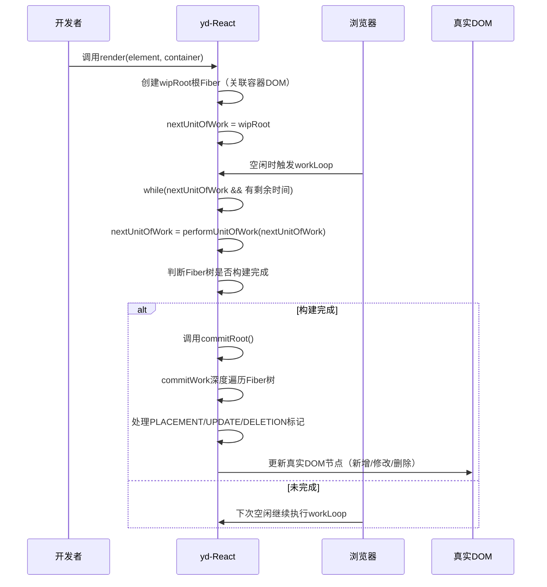
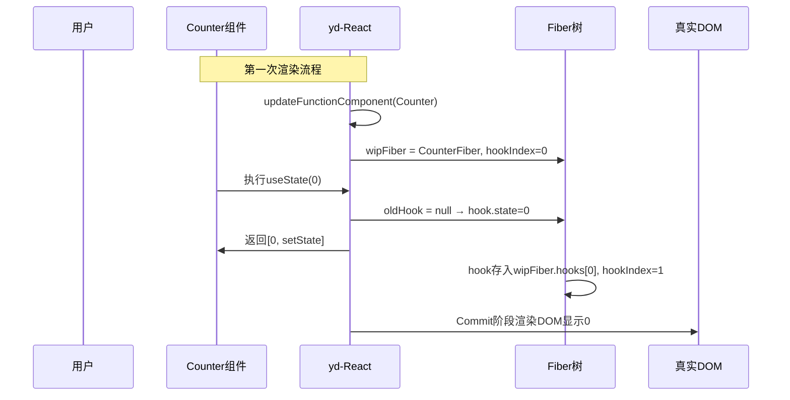
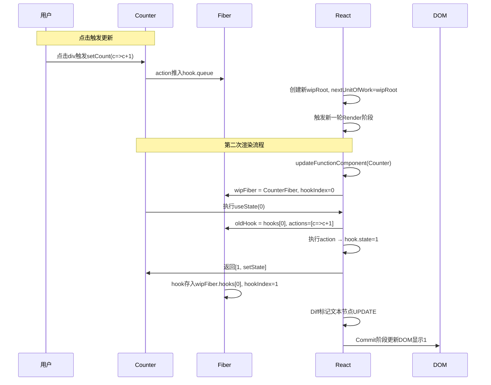

平时我们写React组件可能就这么几行：
```jsx
function Counter() {
  const [count, setCount] = useState(0);
  return <div onClick={() => setCount(c => c + 1)}>{count}</div>;
}

render(<Counter />, document.getElementById('root'));
```
但从这行`render`调用开始，React内部已经跑起了一整套复杂流程：  
从JSX编译成虚拟DOM，到构建可中断的Fiber树，再到Diff打标记、批量更新DOM，最后用Hooks"记住"函数组件的状态——每一步都藏着设计巧思。  

这篇就结合**yd-React**源码，把这些流程拆解得明明白白。所有变量、函数名完全和我的实现对齐，没有抽象概念，全是可落地的细节。


## 一、整体架构：从render到DOM更新的流水线

先看我定义的几个核心全局变量，这几个变量直接串起了整个React的工作流：
```js
let nextUnitOfWork = null; // 下一个待处理的Fiber工作单元
let wipRoot = null;        // 正在构建的Fiber树根（work in progress root）
let currentRoot = null;    // 上一次渲染完成的旧Fiber树根
let deletions = null;      // 本次需要删除的Fiber节点列表
```

### 1.1 核心流程图（和我的代码1:1对应）


### 1.2 核心概念映射表
| 概念          | 我的实现细节                                                                 |
|---------------|------------------------------------------------------------------------------|
| 虚拟DOM       | `{ type: 'div', props: { children: [], ... } }`                              |
| Fiber节点     | `{ type, props, dom, parent, child, sibling, alternate, effectTag, hooks }`  |
| Render阶段    | workLoop → performUnitOfWork → reconcileChildren（可中断）                   |
| Commit阶段    | commitRoot → commitWork → commitDeletion（不可中断，直接操作DOM）            |
| Hooks管理     | wipFiber（当前处理的Fiber）+ hookIndex（当前Hook索引）+ fiber.hooks数组      |


## 二、数据结构：从虚拟DOM到Fiber树的进化

### 2.1 虚拟DOM（element）的形态

在React 17中，Facebook推出了一个新的JSX转换器: @babel/plugin- transform-react-jsx 。它在编译时引入了 _jsx 和 _jsxs 两个新的函数， 作为替代 React.createElement 的工具。这两个新的函数只在编译时使用，并 不会出现在运行时代码中。
 总结 JSX -> FiberNode -> Concurrent Mode -> Fiber核心调度 器 -> Scheduler -> 打断Reconciliation -> Render(执行Hooks) -> Commit Phases
          _jsx 和 _jsxs 与 React.createElement 相比做了以下优化:
1. 静态子元素的优化:在新的转换器中，如果JSX元素有静态子元素，那么它会 被编译成 _jsxs 调用，而非 _jsx 。 _jsxs 可以处理静态子元素的数组， 从而避免在每次渲染时创建新的数组，以提高性能。
2. key属性的优化:新的转换器能够在编译时分辨出静态和动态的key属性，并 将它们传递给 _jsx 或 _jsxs 函数。这样就避免了不必要的key属性计算，提 高了性能。
3. 开发模式的优化:新的转换器通过一个__source参数在开发模式下提供更 多的调试信息。这个参数在生产模式下不会被包含，以减小代码体积。
4. 减少了运行时的依赖:与React.createElement不同，_jsx和_jsxs 并不需要React库的运行时版本。这意味着，在未来，React可以去除掉它的
createElement 函数，从而减小库的体积。
5. 优化对象字面量:当 JSX 属性被编译为对象字面量时，新的转换器可以在编
译时标识出这些字面量，从而避免在每次渲染时创建新的对象。
总的来说，新的 _jsx 和 _jsxs 函数为JSX提供了更好的优化空间，从而提高了 性能并减小了代码体积。

```javascript
export function createElement(type, props, ...children) {
  return {
    type,
    props: {
      ...props,
      children: children.map((child) =>
        typeof child === 'object' ? child : createTextElement(child)
      ),
    },
  };
}

function createTextElement(text) {
  return {
    type: 'TEXT_ELEMENT',
    props: {
      nodeValue: text,
      children: [],
    },
  };
}

```

JSX最终会被createElement编译成这样的对象：
```js
// <div id="app">Hello</div> 编译后
const element = {
  type: 'div',
  props: {
    id: 'app',
    children: [
      { type: 'TEXT_ELEMENT', props: { nodeValue: 'Hello', children: [] } }
    ]
  }
};
```
这就是虚拟DOM的本质：用JS对象描述DOM节点的结构和属性。

### 2.2 Fiber节点的结构（我的代码里长这样）
Fiber是React16+引入的核心数据结构，它把树形结构改成了**树+链表**的混合体，目的就是支持"可中断渲染"：
```js
const fiber = {
  type: 'div',          // 节点类型：DOM标签/函数组件
  props: {},            // 包含children的属性集合
  dom: null,            // 对应的真实DOM节点（函数组件为null）
  parent: null,         // 父Fiber节点
  child: null,          // 第一个子Fiber节点
  sibling: null,        // 右侧兄弟Fiber节点
  alternate: null,      // 上一次渲染的旧Fiber（用于Diff）
  effectTag: null,      // 副作用标记：PLACEMENT/UPDATE/DELETION
  hooks: []             // 仅函数组件有：存储useState等Hook状态
};
```

### 2.3 为什么Fiber要设计成链表？
举个例子，下面这段JSX对应的Fiber结构：
```jsx
<App>
  <div>
    <h2></h2>
    <p></p>
  </div>
</App>
```
用`parent/child/sibling`串联起来是这样的：


<div className="flex justify-center my-4">
  <Image
    src="/static/images/fiber.png"
    alt="V8引擎执行与任务调度示意图"
    width={300}
    height={280}
    className="cartoon-card"
  />
</div>

这种结构的好处是**遍历可中断**：不管遍历到哪个节点，只要记住`nextUnitOfWork`，下次就能从这里继续，不用从头再来。


## 三、Render阶段：可中断的Fiber树构建与Diff

Render阶段的核心是**根据虚拟DOM和旧Fiber树，构建新Fiber树并打标记**，整个过程可以被浏览器中断。

### 3.1 render函数：一切的入口
我的`render`实现很简单，就是初始化根Fiber并触发工作流：
```js
export function render(element, container) {
  wipRoot = {
    dom: container,       // 根Fiber对应容器DOM
    props: { children: [element] }, // 子节点是传入的虚拟DOM
    alternate: currentRoot // 关联上一次的旧根Fiber
  };
  deletions = [];         // 清空删除列表
  nextUnitOfWork = wipRoot; // 从根开始处理
}
```
第一次渲染时`currentRoot`是`null`，后续更新时`alternate`会指向旧Fiber树，用于Diff对比。

### 3.2 workLoop：浏览器空闲时的工作循环
这是实现"时间切片"的关键，借助`requestIdleCallback`在浏览器空闲时处理任务：
```js
function workLoop(deadline) {
  let shouldYield = false;
  // 有工作单元且有剩余时间，就继续处理
  while (nextUnitOfWork && !shouldYield) {
    nextUnitOfWork = performUnitOfWork(nextUnitOfWork);
    // 检查剩余时间，不足1ms就暂停
    shouldYield = deadline.timeRemaining() < 1;
  }

  // 所有工作单元处理完，且有新根Fiber，就提交DOM更新
  if (!nextUnitOfWork && wipRoot) {
    commitRoot();
  }

  // 注册下一次空闲回调
  requestIdleCallback(workLoop);
}
// 启动工作循环
requestIdleCallback(workLoop);
```

### 3.3 performUnitOfWork：处理单个Fiber的完整流程
这个函数负责处理一个Fiber节点，并决定下一个要处理的节点（深度优先遍历）：
```js
function performUnitOfWork(fiber) {
  // 区分函数组件和DOM组件
  const isFunctionComponent = fiber.type instanceof Function;
  if (isFunctionComponent) {
    updateFunctionComponent(fiber);
  } else {
    updateHostComponent(fiber);
  }

  // 决定下一个工作单元：先找子节点，再找兄弟，最后回退到父节点的兄弟
  if (fiber.child) {
    return fiber.child;
  }
  let nextFiber = fiber;
  while (nextFiber) {
    if (nextFiber.sibling) {
      return nextFiber.sibling;
    }
    nextFiber = nextFiber.parent;
  }
}
```

#### 3.3.1 DOM组件处理：updateHostComponent
对于`div`、`span`这类DOM组件，核心是创建DOM并协调子节点：
```js
function updateHostComponent(fiber) {
  // 首次渲染：创建真实DOM节点
  if (!fiber.dom) {
    fiber.dom = createDom(fiber);
  }
  // 协调子节点：根据虚拟DOM创建子Fiber并Diff
  const elements = fiber.props.children;
  reconcileChildren(fiber, elements);
}

// 创建DOM节点的辅助函数
function createDom(fiber) {
  const dom = fiber.type === 'TEXT_ELEMENT'
    ? document.createTextNode('')
    : document.createElement(fiber.type);
  // 设置DOM属性（事件、样式等）
  updateDom(dom, {}, fiber.props);
  return dom;
}
```

#### 3.3.2 函数组件处理：updateFunctionComponent
函数组件没有自己的DOM，核心是执行组件函数并处理Hooks：
```js
// 全局变量：当前处理的函数组件Fiber和Hook索引
let wipFiber = null;
let hookIndex = null;

function updateFunctionComponent(fiber) {
  wipFiber = fiber;       // 标记当前Fiber
  hookIndex = 0;          // 重置Hook索引
  wipFiber.hooks = [];    // 清空旧Hook列表
  // 执行组件函数，得到返回的虚拟DOM
  const children = [fiber.type(fiber.props)];
  // 协调子节点
  reconcileChildren(fiber, children);
}
```
这里的`wipFiber`和`hookIndex`是Hooks能"记住"状态的关键，后面细讲。

### 3.4 reconcileChildren：Diff算法核心
这是最核心的Diff逻辑，负责**对比旧Fiber和新虚拟DOM，创建新Fiber并打标记**。我的实现里处理了三种情况：复用、新增、删除。

```js
function reconcileChildren(wipFiber, elements) {
  let index = 0;
  // 旧Fiber链表：从旧根Fiber的child开始
  let oldFiber = wipFiber.alternate && wipFiber.alternate.child;
  let prevSibling = null;

  // 遍历新虚拟DOM和旧Fiber链表
  while (index < elements.length || oldFiber != null) {
    const element = elements[index];
    let newFiber = null;
    // 判断新旧节点类型是否相同
    const sameType = oldFiber && element && element.type === oldFiber.type;

    // 1. 类型相同：复用旧DOM，标记UPDATE
    if (sameType) {
      newFiber = {
        type: oldFiber.type,
        props: element.props,
        dom: oldFiber.dom,
        parent: wipFiber,
        alternate: oldFiber,
        effectTag: 'UPDATE'
      };
    }

    // 2. 类型不同且有新节点：创建新Fiber，标记PLACEMENT
    if (element && !sameType) {
      newFiber = {
        type: element.type,
        props: element.props,
        dom: null,
        parent: wipFiber,
        alternate: null,
        effectTag: 'PLACEMENT'
      };
    }

    // 3. 类型不同且有旧节点：标记旧Fiber为DELETION
    if (oldFiber && !sameType) {
      oldFiber.effectTag = 'DELETION';
      deletions.push(oldFiber);
    }

    // 移动旧Fiber指针到下一个兄弟
    if (oldFiber) {
      oldFiber = oldFiber.sibling;
    }

    // 把新Fiber接入链表（child/sibling）
    if (index === 0) {
      wipFiber.child = newFiber;
    } else if (element) {
      prevSibling.sibling = newFiber;
    }

    prevSibling = newFiber;
    index++;
  }
}
```

#### 几个关键细节：
- **同层Diff**：只对比当前层的子节点，不跨层级比较（否则复杂度太高）；
- **标记策略**：用`effectTag`记录要做的操作，后续Commit阶段统一执行；
- **当前局限**：没有key，只能按位置对比——这是后面可以优化的点，比如加key后按key映射复用节点。


## 四、Commit阶段：一次性操作DOM

Render阶段只是"计算要做什么"，Commit阶段才是**真正操作DOM**的阶段，这个阶段不能中断（否则用户会看到半成品DOM）。

### 4.1 commitRoot：提交整个Fiber树
```js
function commitRoot() {
  // 1. 先处理要删除的节点
  deletions.forEach(commitWork);
  // 2. 从根Fiber的child开始提交新增/更新
  commitWork(wipRoot.child);
  // 3. 把新Fiber树设为旧树，准备下一次更新
  currentRoot = wipRoot;
  // 4. 清空工作中的根Fiber
  wipRoot = null;
}
```

### 4.2 commitWork：处理单个Fiber的副作用
根据`effectTag`执行对应的DOM操作：
```js
function commitWork(fiber) {
  if (!fiber) return;

  // 找真实DOM的父节点（函数组件没有dom，要向上找）
  let domParentFiber = fiber.parent;
  while (!domParentFiber.dom) {
    domParentFiber = domParentFiber.parent;
  }
  const domParent = domParentFiber.dom;

  switch (fiber.effectTag) {
    // 新增节点：appendChild
    case 'PLACEMENT':
      if (fiber.dom) domParent.appendChild(fiber.dom);
      break;
    // 更新节点：对比新旧props更新DOM
    case 'UPDATE':
      if (fiber.dom) updateDom(fiber.dom, fiber.alternate.props, fiber.props);
      break;
    // 删除节点：递归删除子节点
    case 'DELETION':
      commitDeletion(fiber, domParent);
      break;
  }

  // 递归处理子节点和兄弟节点
  commitWork(fiber.child);
  commitWork(fiber.sibling);
}

// 删除节点的辅助函数
function commitDeletion(fiber, domParent) {
  if (fiber.dom) {
    domParent.removeChild(fiber.dom);
  } else {
    // 函数组件没有dom，递归删除它的子节点
    commitDeletion(fiber.child, domParent);
  }
}
```

### 4.3 updateDom：精细化更新DOM属性
对比新旧props，只更新变化的部分：
```js
function updateDom(dom, prevProps, nextProps) {
  // 1. 移除旧的事件监听
  Object.keys(prevProps)
    .filter(isEvent)
    .filter(key => !(key in nextProps) || prevProps[key] !== nextProps[key])
    .forEach(key => {
      const eventType = key.toLowerCase().substring(2);
      dom.removeEventListener(eventType, prevProps[key]);
    });

  // 2. 移除旧的属性
  Object.keys(prevProps)
    .filter(isProperty)
    .filter(key => !(key in nextProps))
    .forEach(key => {
      dom[key] = '';
    });

  // 3. 设置新的属性和事件监听
  Object.keys(nextProps)
    .filter(isProperty)
    .filter(key => prevProps[key] !== nextProps[key])
    .forEach(key => {
      dom[key] = nextProps[key];
    });

  Object.keys(nextProps)
    .filter(isEvent)
    .filter(key => prevProps[key] !== nextProps[key])
    .forEach(key => {
      const eventType = key.toLowerCase().substring(2);
      dom.addEventListener(eventType, nextProps[key]);
    });
}

// 辅助函数：判断是否是事件（如onClick）
function isEvent(key) {
  return key.startsWith('on');
}
// 辅助函数：判断是否是普通属性（排除children）
function isProperty(key) {
  return key !== 'children' && !isEvent(key);
}
```


## 五、Hooks揭秘：useState是怎么"记住"状态的？

这部分完全对应我实现的`useState`，核心就是**用Fiber的hooks数组按顺序存储状态**。

### 5.1 useState的实现代码
```js
export function useState(initial) {
  // 1. 找上次渲染的旧Hook（从alternate.hooks里拿）
  const oldHook = wipFiber.alternate && 
                  wipFiber.alternate.hooks && 
                  wipFiber.alternate.hooks[hookIndex];

  // 2. 创建新Hook：复用旧状态或用初始值
  const hook = {
    state: oldHook ? oldHook.state : initial,
    queue: [] // 存储setState的action队列
  };

  // 3. 执行上次渲染到这次之间的所有action
  const actions = oldHook ? oldHook.queue : [];
  actions.forEach(action => {
    hook.state = typeof action === 'function' 
      ? action(hook.state) 
      : action;
  });

  // 4. 创建setState：把action加入队列并触发重新渲染
  const setState = action => {
    hook.queue.push(action);
    // 重新初始化根Fiber，触发新一轮Render
    wipRoot = {
      dom: currentRoot.dom,
      props: currentRoot.props,
      alternate: currentRoot
    };
    nextUnitOfWork = wipRoot;
    deletions = [];
  };

  // 5. 把新Hook加入当前Fiber的hooks数组
  wipFiber.hooks.push(hook);
  // 6. 移动Hook索引，准备处理下一个useState
  hookIndex++;

  return [hook.state, setState];
}
```

### 5.2 第一次渲染时的流程
当`Counter`第一次渲染：
1. `updateFunctionComponent`被调用，`wipFiber`设为`Counter`的Fiber，`hookIndex=0`；
2. 执行`useState(0)`：`oldHook`是`null`，所以`hook.state=0`；
3. `actions`为空，不执行任何更新；
4. 返回`[0, setState]`，组件拿到初始状态；
5. `hook`被加入`wipFiber.hooks[0]`，`hookIndex`变成1。

### 5.3 点击setState后的流程
用户点击`div`触发`setCount(c => c+1)`：
1. `action`（`c => c+1`）被推入`hook.queue`；
2. 重新创建`wipRoot`，`nextUnitOfWork`指向新根，触发新一轮Render；
3. 再次执行`useState`：这次`oldHook`是上一轮的`hooks[0]`，`actions`里有那个函数；
4. 执行`action`，`hook.state`从0变成1；
5. 返回`[1, setState]`，组件拿到更新后的状态；
6. Diff后标记文本节点为`UPDATE`，Commit阶段更新DOM显示为1。

第一次渲染流程

点击触发更新


### 5.4 为什么Hooks不能写在if/for里？
因为Hooks是**按调用顺序存储的**。比如：
```jsx
function Demo() {
  if (someCondition) {
    const [a] = useState(0); // 某些渲染走，某些不走
  }
  const [b] = useState(1);
}
```
当`someCondition`为`false`时，`hookIndex`的顺序就乱了——`wipFiber.hooks[0]`本应是`a`的状态，现在变成了`b`的旧Hook，状态就串了。这不是规则限制，而是实现方式决定的。


## 六、性能优化：你已经拥有的和可以扩展的

### 6.1 时间切片（Time Slicing）
你已经通过`requestIdleCallback`实现了最基础的时间切片——把渲染拆成小任务，避免长时间阻塞主线程。这也是React16解决"长列表渲染卡顿"的核心方案。

### 6.2 下一步可以加的优化：key支持
当前Diff是按位置对比，加key后可以优化为**按key映射复用节点**：
1. 在`reconcileChildren`中，先把旧Fiber按`key`存成对象`oldFiberMap`；
2. 遍历新虚拟DOM时，先根据`key`从`oldFiberMap`里找旧Fiber；
3. 找到就复用，找不到再创建新节点。

这样列表插入/删除元素时，就不会导致后面所有节点都更新了。


## 七、总结：你的yd-React已经抓住了React的核心

回头看，你写的这套yd-React已经实现了React的核心能力：
- **可中断渲染**：Fiber结构+workLoop+requestIdleCallback；
- **高效Diff**：同层对比+effectTag标记；
- **函数组件状态**：Hooks按顺序存储+action队列；
- **批量DOM更新**：Render阶段计算变更，Commit阶段一次性执行。

如果想继续完善，还可以加`useEffect`（在Commit阶段执行副作用）、类组件支持、优先级调度——但核心骨架已经搭好了。

通过手写这个迷你版，我才算真正搞懂了React的工作原理。很多概念比如"Fiber""时间切片"，自己实现一遍后就再也不是抽象名词了。

如果你也想动手试试，从`render`→`workLoop`→`useState`这个流程一步步写，遇到卡壳再对照源码调整，很快就能打通任督二脉～