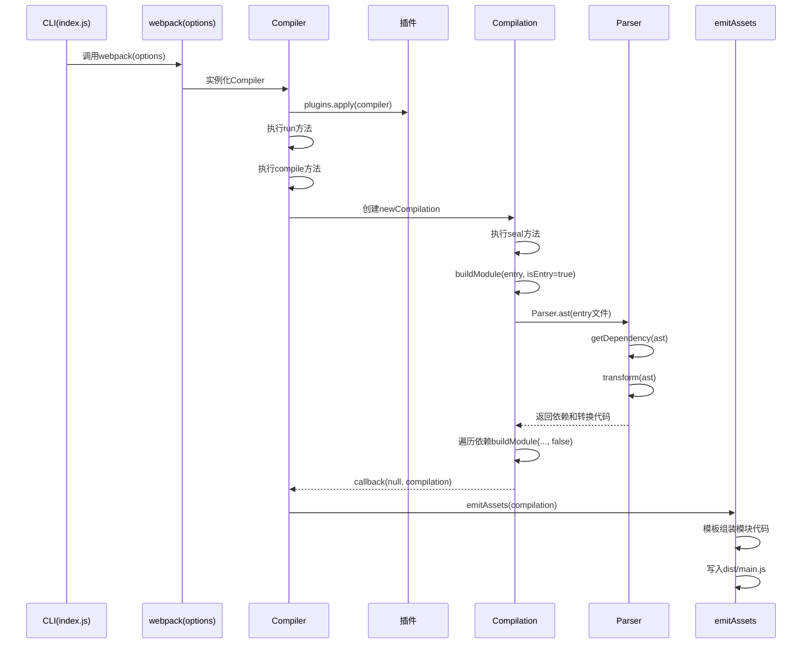

## 概览
ydPack 是一个极简的 JavaScript 打包器，实现了 Webpack 的核心思想：**入口加载→依赖解析→代码转换→模块收集→产物生成**。通过 `tapable` 暴露钩子支持插件扩展，流程与 Webpack 一致但大幅简化，适合理解打包器底层原理。


<div className="flex justify-center my-4">
  <Image
    src="/static/images/webpack02.png"
    alt="V8引擎执行与任务调度示意图"
    width={1200}
    height={680}
    className="cartoon-card"
  />
  
</div>

## 目录结构
```
ydPack/
├── index.js        # CLI启动入口，创建编译器并运行
├── webpack.js      # 工厂函数，组装Compiler并应用插件
├── Compiler.js     # 编译器核心，调度编译流程与产物生成
├── Compilation.js  # 单次编译生命周期，构建模块与收集依赖
├── Parser.js       # AST解析、依赖收集、代码转换（Babel）
├── Chunk.js        # 代码块项，封装多个模块的代码
├── Module.js       # 模块项，封装模块代码与元数据
├── Dependency.js   # 依赖项，记录模块间的依赖关系
└── Template.js     # 模板引擎，组装最终产物（如main.js）
```


## 核心流程图



## 模块职责与实现要点

### 1. index.js：CLI入口
读取用户配置，初始化编译器并启动编译，处理错误日志：
```js
const webpack = require('./webpack');
const options = require('../ydpack.config.js');

const compiler = webpack(options);

compiler.run((err) => {
  if (err) {
    console.log('编译出错', err);
  }
});
```

### 2. webpack.js：工厂函数
创建 `Compiler` 实例并应用外部插件：
```js
const Compiler = require('./Compiler');

const webpack = function (options) {
  const compiler = new Compiler(options);
  if (Array.isArray(options.plugins)) {
    for (const plugin of options.plugins) {
      plugin.apply(compiler); // 挂载插件
    }
  }
  return compiler;
};

module.exports = webpack;
```

### 3. Compiler.js：编译器核心
- 暴露钩子（如 `run`）支持插件扩展；
- `run` 方法拉起构建流程，`emitAssets` 生成最终产物；
- 封装编译逻辑，协调 `Compilation` 完成模块构建。

```js
const { SyncHook } = require('tapable');
const Compilation = require('./Compilation');
const { join } = require('path');
const fs = require('fs');

class Compiler {
  constructor(options) {
    this.options = options;
    this.entry = options.entry;
    this.output = options.output;
    this.modules = [];
    this.hooks = { run: new SyncHook(['compilation']) }; // 插件钩子
  }

  run(callback) {
    console.log('[ 开始构建 ]');
    const onCompiled = (err, compilation) => {
      this.emitAssets(compilation); // 生成产物
    };
    this.compile(onCompiled);
  }

  compile(callback) {
    const compilation = this.newCompilation();
    this.hooks.run.call(compilation); // 触发插件钩子
    compilation.seal(callback);
  }

  newCompilation() {
    return new Compilation(this);
  }

  emitAssets(compilation) {
    console.log('🌺[ 生成dist main.js文件 ]🌺');
    const outputPath = join(this.output.path, this.output.filename);
    
    // 拼接模块表
    let _modules = '';
    this.modules.map((_module) => {
      _modules += `"${_module.filename}":(function (module, exports, require) { 
                    ${_module.transformCode}
                  }),`;
    });

    // 运行时模板（模拟Webpack的__webpack_require__）
    const template = `(function (modules) {
      var installedModules = {};
      function __webpack_require__(moduleId) {
          if (installedModules[moduleId]) return installedModules[moduleId].exports;
          var module = installedModules[moduleId] = { exports: {} };
          modules[moduleId].call(module.exports, module, module.exports, __webpack_require__);
          return module.exports;
      }
      return __webpack_require__("${this.entry}");
    })({ ${_modules} })`;

    fs.writeFileSync(outputPath, template, 'utf-8');
  }
}

module.exports = Compiler;
```

### 4. Compilation.js：单次编译生命周期
- 维护本次编译的 `modules` 列表；
- `seal` 方法递归构建入口与依赖模块；
- `buildModule` 调用 `Parser` 解析模块并转换代码。

```js
const { join } = require('path');
const Parser = require('./Parser');

class Compilation {
  constructor(compiler) {
    const { options, modules } = compiler;
    this.options = options;
    this.modules = modules;
  }

  seal(callback) {
    const entryModule = this.buildModule(this.options.entry, true);
    this.modules.push(entryModule);
    
    // 递归处理依赖模块
    this.modules.map((_module) => {
      _module.dependencies.map((dependency) => {
        this.modules.push(this.buildModule(dependency, false));
      });
    });

    callback(null, this);
  }

  buildModule(filename, isEntry) {
    let absolutePath = '';
    let ast = '';
    if (!isEntry) {
      absolutePath = join(process.cwd(), './src/', filename); // 依赖路径约定
      ast = Parser.ast(absolutePath);
    } else {
      ast = Parser.ast(filename);
    }

    const dependencies = Parser.getDependency(ast);
    const transformCode = Parser.transform(ast);

    return { filename, dependencies, transformCode };
  }
}

module.exports = Compilation;
```

### 5. Parser.js：AST解析与转换
- `ast`：读取文件并生成AST；
- `getDependency`：遍历AST收集 `import` 依赖；
- `transform`：使用Babel将ES6+转为ES5。

```js
const babylon = require('babylon');
const traverse = require('babel-traverse').default;
const fs = require('fs');
const { transformFromAstSync } = require('@babel/core');

class Parser {
  static ast(path) {
    const content = fs.readFileSync(path, 'utf-8');
    return babylon.parse(content, { sourceType: 'module' });
  }

  static getDependency(ast) {
    const dependencies = [];
    traverse(ast, {
      ImportDeclaration: ({ node }) => {
        dependencies.push(node.source.value); // 收集import路径
      },
    });
    return dependencies;
  }

  static transform(ast) {
    const { code } = transformFromAstSync(ast, null, {
      presets: ['@babel/preset-env'], // ES6转ES5
    });
    return code;
  }
}

module.exports = Parser;
```


## 运行时产物模板
ydPack 生成的产物是一个自执行函数，包含：
- `modules` 表：存储所有模块的编译后代码；
- `installedModules`：模块缓存，避免重复加载；
- `__webpack_require__`：模拟模块加载器，实现 `require` 逻辑；
- 入口模块执行：通过 `__webpack_require__(entry)` 启动应用。


## 插件机制扩展
通过 `compiler.hooks` 可扩展打包流程，例如实现一个简单插件：
```js
// 自定义插件
class LoggerPlugin {
  apply(compiler) {
    compiler.hooks.run.tap('LoggerPlugin', (compilation) => {
      console.log('🚀 编译开始了！');
    });
  }
}

// 配置文件中使用
module.exports = {
  entry: './src/index.js',
  output: { path: './dist', filename: 'main.js' },
  plugins: [new LoggerPlugin()],
};
```


## 备注
- 依赖路径约定：非入口模块从项目根目录的 `src/` 解析；
- 输出路径：由配置的 `output.path` 和 `output.filename` 决定；
- 空文件说明：`Chunk.js`/`Module.js` 等为占位，对应 Webpack 中更复杂的模块/Chunk 管理，ydPack 简化后暂未实现。


## 核心特性总结
| 功能         | 实现方式                          |
|--------------|-----------------------------------|
| 依赖解析     | 遍历AST收集`import`语句           |
| 代码转换     | Babel将ES6+转为ES5                |
| 模块缓存     | `installedModules`对象缓存已加载模块 |
| 插件扩展     | `tapable`钩子触发自定义逻辑        |
| 产物生成     | 拼接运行时模板并写入文件          |
