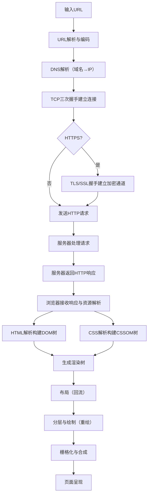
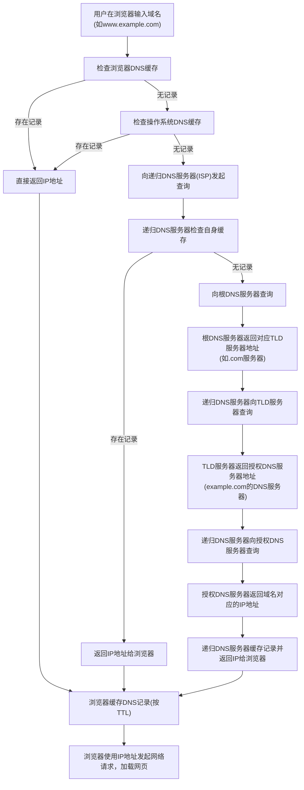

## 一、整体流程全景图
从用户输入URL到页面完全渲染，是**网络通信**与**浏览器内核渲染**深度协同的过程，可细分为**15个核心环节**，每个环节均涉及底层协议与机制：  



## 二、阶段一：URL解析与网络请求（从URL到服务器响应）
### 1. 步骤1：URL输入与解析
- **用户操作**：在浏览器地址栏输入`https://www.example.com/path?query=123#hash`，浏览器首先触发**地址栏搜索判断**（若为搜索关键词则跳转搜索引擎，否则按URL处理）；  
- **URL结构解析**：  
  - 协议（Scheme）：`https`（决定传输层协议与加密方式）；  
  - 域名（Host）：`www.example.com`（需解析为IP）；  
  - 路径（Path）：`/path`（服务器资源路径）；  
  - 查询参数（Query）：`?query=123`（键值对参数）；  
  - 锚点（Hash）：`#hash`（客户端页面内定位，不发送至服务器）；  
- **特殊处理**：  
  - 非ASCII字符编码：如中文域名`www.百度.com`会通过**Punycode编码**转为`www.xn--baidu-93t.com`；  
  - 协议补全：若输入`www.example.com`，默认补全为`http://`（部分浏览器优先`https`）。


### 2. 步骤2：DNS解析（域名→IP的完整链路）
DNS解析是“**分布式域名系统协作**”的过程，核心解决“域名与IP的映射”，流程如下：  

#### （1）本地缓存查询（最快路径）
- **浏览器缓存**：Chrome默认缓存DNS记录1分钟（可通过`chrome://net-internals/#dns`查看）；  
- **操作系统缓存**：Windows读取`C:\Windows\System32\drivers\etc\hosts`文件，Linux/macOS读取`/etc/hosts`；  
- **路由器缓存**：路由器内置DNS缓存，覆盖局域网内所有设备；  
- **ISP缓存**：互联网服务提供商（如电信、联通）的DNS服务器缓存。  

#### （2）递归查询（用户→递归DNS服务器）
若本地缓存无结果，浏览器向**递归DNS服务器**（由ISP分配或手动设置，如8.8.8.8）发起请求：  
- 递归服务器承诺“全程代理查询，返回最终IP”，而非中间结果；  
- 递归服务器首先查询自身缓存，命中则直接返回，未命中则进入**迭代查询**。  

#### （3）迭代查询（递归DNS→根→顶级域→授权DNS）
迭代查询是“**逐层向上请求**”的过程，每个服务器仅返回下一级服务器地址：  
1. **根DNS服务器**（全球共13组）：收到请求后，返回`.com`顶级域（TLD）服务器的IP；  
2. **顶级域DNS服务器**（负责`.com`/`.cn`等后缀）：返回`example.com`的**授权DNS服务器**IP；  
3. **授权DNS服务器**（域名持有者配置，如阿里云DNS）：存储`www.example.com`的A记录（IPv4）或AAAA记录（IPv6），返回目标IP地址。  

#### （4）结果返回与缓存
- 递归DNS服务器将IP返回给浏览器，并缓存该记录（TTL由域名解析商设置，通常为5分钟~24小时）；  
- 浏览器缓存IP，用于后续TCP连接，避免重复解析。  

#### （5）DNS优化技术
- **DNS预解析**：通过`<link rel="dns-prefetch" href="//www.example.com">`提前解析可能用到的域名；  
- **DNS负载均衡**：授权DNS返回多个IP，实现服务器集群负载均衡；  
- **EDNS（扩展DNS）**：支持更大的DNS报文，携带更多信息（如客户端IP，实现精准路由）。



### 3. 步骤3：TCP连接建立（三次握手与底层细节）
TCP是**面向连接、可靠的字节流协议**，通过“三次握手”确保客户端与服务器双向通信能力，底层依赖IP协议（不可靠）实现可靠传输：  

#### （1）三次握手具体流程
| 握手次数 | 发送方 | 报文内容 | 状态变化 | 目的 |
|----------|--------|----------|----------|------|
| 第一次 | 客户端 | SYN=1，序列号=J | 客户端：SYN-SENT | 向服务器发起连接请求，告知服务器客户端的初始序列号J |
| 第二次 | 服务器 | SYN=1，ACK=1，确认号=J+1，序列号=K | 服务器：SYN-RECEIVED | 确认收到客户端请求（ACK=1+确认号=J+1），同时发起服务器的连接请求（SYN=1+序列号=K） |
| 第三次 | 客户端 | ACK=1，确认号=K+1 | 双方：ESTABLISHED | 确认收到服务器请求，连接正式建立 |

#### （2）核心设计原因
- **为何需要三次握手**：防止“延迟的连接请求报文”被服务器误处理。若仅两次握手，服务器可能为已失效的请求建立连接，浪费资源；  
- **序列号作用**：TCP是字节流协议，序列号用于标记数据的顺序，确保接收方按序重组数据；  
- **窗口机制**：三次握手时会协商**初始窗口大小**，用于后续流量控制（避免发送方发送过快导致接收方缓冲区溢出）。


### 4. 步骤4：TLS/SSL握手（HTTPS加密原理）
HTTPS = HTTP + TLS/SSL，通过TLS握手建立**端到端加密通道**，防止数据被窃听或篡改，流程如下：  

#### （1）TLS 1.3握手简化流程（现代浏览器主流）
1. **客户端Hello**：发送支持的TLS版本（如1.3）、加密套件（如TLS_AES_256_GCM_SHA384）、随机数ClientRandom；  
2. **服务器Hello**：确认TLS版本与加密套件、发送随机数ServerRandom、返回服务器证书（含公钥）；  
3. **客户端验证证书**：  
   - 验证证书颁发机构（CA）合法性（根CA内置在浏览器中）；  
   - 验证证书有效期、域名匹配性；  
4. **密钥协商**：  
   - 客户端生成**预主密钥（Pre-Master Secret）**，用服务器公钥加密后发送；  
   - 双方通过ClientRandom、ServerRandom、Pre-Master Secret计算**会话密钥（Session Key）**；  
5. **握手完成**：双方发送“握手完成”消息，后续HTTP数据用会话密钥加密传输。  

#### （2）加密核心机制
- **非对称加密**：仅用于握手阶段的密钥交换（公钥加密、私钥解密），避免会话密钥被窃听；  
- **对称加密**：数据传输阶段用会话密钥加密（速度快，适合大量数据）；  
- **数字证书**：证明服务器身份，防止“中间人攻击”（伪造服务器公钥）。


### 5. 步骤5：HTTP请求构建与发送
浏览器基于HTTP协议构建请求报文，通过已建立的TCP/TLS连接发送给服务器：  

#### （1）HTTP请求报文结构
```plaintext
GET /path?query=123 HTTP/1.1  # 请求行
Host: www.example.com         # 请求头（键值对）
User-Agent: Mozilla/5.0 (Windows NT 10.0; Win64; x64) Chrome/118.0.0.0
Accept: text/html,application/xhtml+xml
Cookie: sessionId=abc123
                              # 空行（分隔请求头与请求体）
username=admin&password=123   # 请求体（POST/PUT等方法需携带）
```

- **请求行**：包含请求方法（GET/POST/PUT/DELETE）、请求URI、HTTP版本；  
- **请求头**：  
  - 通用头：`Cache-Control`（缓存控制）、`Connection`（连接管理）；  
  - 请求头：`Host`（目标域名）、`User-Agent`（客户端信息）、`Accept`（可接受的响应格式）；  
  - 实体头：`Content-Type`（请求体格式，如`application/json`）、`Content-Length`（请求体长度）；  
- **请求体**：仅非GET方法使用，携带表单数据、JSON等。  

#### （2）HTTP/2优化特性
- **多路复用**：单个TCP连接可并行传输多个请求/响应（通过帧标识不同流），避免HTTP/1.1的“队头阻塞”；  
- **服务器推送**：服务器主动推送关联资源（如HTML引用的CSS/JS），减少客户端请求次数；  
- **头部压缩**：用HPACK算法压缩请求头，减少传输体积。


### 6. 步骤6：服务器处理与HTTP响应
服务器接收请求后，通过“**应用服务器→业务逻辑→数据存储**”的流程处理，最终返回响应报文：  

#### （1）服务器处理流程
1. **请求解析**：Web服务器（如Nginx/Apache）接收请求，解析请求行/头，转发至应用服务器（如Node.js/Java）；  
2. **业务逻辑执行**：应用服务器执行代码（如查询数据库、计算数据）；  
3. **响应构建**：生成HTML/JSON等响应数据，封装为HTTP响应报文。  

#### （2）HTTP响应报文结构
```plaintext
HTTP/1.1 200 OK              # 状态行
Date: Wed, 22 Nov 2025 08:00:00 GMT  # 响应头
Server: Nginx
Content-Type: text/html; charset=utf-8
Content-Length: 1024
Cache-Control: max-age=3600

<!DOCTYPE html>              # 响应体
<html>
  <head><title>Example</title></head>
  <body>Hello World</body>
</html>
```

- **状态行**：HTTP版本、状态码（200=成功，404=未找到，500=服务器错误）、状态短语；  
- **响应头**：`Content-Type`（响应体格式）、`Cache-Control`（缓存策略）、`Set-Cookie`（设置Cookie）；  
- **响应体**：服务器返回的实际数据（HTML、JSON、图片等）。  


## 三、阶段二：浏览器渲染阶段（从HTML到页面呈现）
浏览器接收响应后，由**渲染进程**（Renderer Process）完成渲染，该进程采用“**多线程协作**”模式，核心线程包括主线程、合成线程、栅格化线程、GPU线程。


### 1. 步骤7：资源接收与预加载扫描
- **响应接收**：浏览器通过网络线程接收响应数据，若为HTML则交给渲染进程；  
- **预加载扫描器**：主线程解析HTML前，启动**预加载扫描器（Preload Scanner）** 快速扫描HTML中的`<link>`、`<script>`、``等标签，提前发起资源请求（如CSS、JS、图片），减少等待时间；  
- **资源优先级**：浏览器按“关键资源（CSS/JS）→ 预加载资源（preload）→ 普通资源（图片）”的优先级调度请求。


### 2. 步骤8：HTML解析与DOM树构建
HTML解析是“**从字符串到结构化树**”的过程，由主线程完成：  

#### （1）解析流程
1. **词法分析（Tokenization）**：将HTML字符串拆分为**Token**（标签、属性、文本、注释等），如`<div class="box">`拆分为`StartTag: div, 属性: class=box`；  
2. **语法分析（Tree Construction）**：根据Token构建**DOM树**（Document Object Model），每个Token对应一个DOM节点，节点间通过父子/兄弟关系形成树状结构；  
3. **错误处理**：HTML解析器具备“容错性”，会自动修复语法错误（如未闭合标签、嵌套错误）。  

#### （2）JS对解析的阻塞影响
- **同步`<script>`**：主线程解析到`<script src="xxx.js">`时，会暂停HTML解析，优先下载并执行JS（因JS可能通过`document.write`修改DOM）；  
- **异步`<script>`**：  
  - `defer`：异步下载JS，下载完成后**按顺序执行**（在DOMContentLoaded事件前）；先攒齐所有 defer 脚本，按写在 HTML 里的顺序依次执行，不插队  
  - `async`：异步下载JS，下载完成后**立即执行**（顺序不确定）；  谁先下载完谁先执行，不管顺序，直接暂停当前 HTML 解析去执行，执行完再继续。
- **动态脚本**：通过`document.createElement('script')`创建的脚本，默认异步加载（`async=true`）。


### 3. 步骤9：CSS解析与CSSOM树构建
CSS解析与HTML解析并行进行，最终生成**CSSOM树**（CSS Object Model）： **CSS 解析与 HTML 解析并行，确会阻塞 HTML 的渲染**

#### （1）解析流程
1. **词法分析**：将CSS字符串拆分为Token（如选择器、属性名、属性值）；  
2. **语法分析**：将Token转换为“样式规则”（如`div.box { font-size: 16px }`）；  
3. **CSSOM树构建**：按选择器优先级和层级关系，将样式规则挂载到对应的DOM节点上，形成CSSOM树（树节点包含元素的所有样式属性）。  

#### （2）CSS加载阻塞特性
- **`<link rel="stylesheet">`**：异步下载CSS，但会阻塞**渲染树生成**（因CSSOM需与DOM合并），但不阻塞HTML解析；  
- **`@import`**：同步加载CSS，会阻塞HTML解析和渲染（不推荐使用）；  
- **媒体查询**：`<link rel="stylesheet" media="print">`（打印样式）不会阻塞屏幕渲染。


### 4. 步骤10：渲染树生成（DOM + CSSOM）
渲染树是“**可见元素的样式化树**”，由主线程合并DOM树与CSSOM树生成：  
- **过滤不可见节点**：移除`display: none`、`<head>`、`<script>`等不可见元素；  
- **样式计算**：为每个可见节点应用CSSOM中的样式（优先级：!important > 内联样式 > ID选择器 > 类选择器 > 标签选择器）；  
- **生成渲染树节点**：每个节点包含元素的样式和层级关系，不包含几何信息。


### 5. 步骤11：布局（Layout/回流）
布局是“**计算元素几何信息**”的过程，主线程遍历渲染树，计算每个节点的位置和大小：  

#### （1）核心操作
- **视口计算**：确定浏览器视口大小（`window.innerWidth`/`window.innerHeight`）；  
- **盒模型计算**：基于CSS盒模型（content+padding+border+margin）计算每个元素的宽高；  
- **位置计算**：采用“**流式布局**”（默认），从根节点开始，按文档流顺序计算每个节点的坐标（x/y轴位置）；  
- **生成布局树**：记录每个节点的几何信息（宽、高、左、右、上、下）。  

#### （2）回流触发条件（性能敏感）
- DOM结构修改：添加/删除节点、改变元素层级；  
- 几何属性修改：`width`、`height`、`margin`、`padding`、`position`；  
- 窗口大小变化：`resize`事件；  
- 读取触发回流的属性：`offsetWidth`、`offsetHeight`、`scrollTop`、`getComputedStyle`（会强制刷新渲染队列，导致“同步布局抖动”）。


### 6. 步骤12：分层（Layering）
为优化渲染性能，主线程将渲染树拆分为多个**合成层**（Composited Layer），每个合成层对应独立的渲染单元：  

#### （1）分层触发条件
- 根元素（`<html>`）；  
- `position: fixed/absolute`且`z-index`不为auto；  
- 含`transform`（3D变换优先）、`opacity`动画；  
- 含CSS滤镜（`filter`）、`<canvas>`、`<video>`、`<iframe>`；  
- `will-change: transform/opacity`（手动触发分层，提前优化）。  

#### （2）分层优势
- 局部变化仅影响所在合成层，避免整个页面回流/重绘；  
- 合成层由GPU加速渲染，提升动画流畅度。


### 7. 步骤13：绘制（Paint/重绘）
绘制是“**为合成层填充像素**”的过程，主线程为每个合成层生成**绘制列表**：  

#### （1）绘制流程
1. **绘制指令生成**：按“从后到前”的顺序（z-index层级）生成绘制指令，如“绘制背景色→绘制边框→绘制文字→绘制图片”；  
2. **绘制列表提交**：主线程将绘制列表提交给**合成线程**，后续流程由合成线程主导（不阻塞主线程）。  

#### （2）重绘触发条件
- 元素外观变化但不影响几何属性：`color`、`background-color`、`box-shadow`、`border-color`；  
- 重绘仅影响单个合成层，性能开销低于回流。


### 8. 步骤14：栅格化（Rasterization）
栅格化是“**将绘制列表转为像素数据**”的过程，由**栅格化线程池**（多线程）完成：  
- **分块栅格化**：合成线程将合成层按视口大小拆分为**256x256**或**512x512**的小图块（Tile），并行栅格化；  
- **优先级调度**：优先栅格化“当前视口可见”的图块，提升首屏渲染速度；  
- **像素生成**：栅格化线程执行绘制指令，生成每个图块的像素数据（位图），存储在GPU纹理中。


### 9. 步骤15：合成与呈现（Compositing）
合成是“**合并图层像素并显示到屏幕**”的过程，由合成线程与GPU协作完成：  
1. **图层排序**：合成线程按z-index层级排序所有合成层的图块；  
2. **发送绘制指令**：合成线程向GPU发送`DrawQuad`指令（包含图块位置、纹理地址）；  
3. **GPU合成**：GPU将所有图块纹理合并为最终屏幕图像，通过**VSync（垂直同步）** 信号同步到显示器；  
4. **页面呈现**：显示器按刷新率（通常60Hz）显示图像，完成页面渲染。


## 四、核心性能优化策略（按阶段划分）
### 1. 网络请求阶段优化
- **DNS优化**：DNS预解析、缩短TTL缓存时间（动态内容）；  
- **连接优化**：启用HTTP/2/3、TCP长连接（`Connection: keep-alive`）；  
- **资源优化**：  
  - 静态资源CDN加速（边缘节点缓存）；  
  - 资源压缩（gzip/Brotli压缩文本，WebP/AVIF压缩图片）；  
  - 资源合并（减少HTTP请求，如CSS Sprite）；  
- **缓存策略**：  
  - 强缓存（`Cache-Control: max-age=31536000`）；  
  - 协商缓存（`ETag`/`Last-Modified`）。

### 2. 渲染阶段优化
- **减少回流/重绘**：  
  - 批量DOM操作（`DocumentFragment`、模板字符串）；  
  - 分离读写操作（避免同步布局抖动，如先读取所有属性再修改）；  
  - 用`transform/opacity`做动画（仅触发合成，不触发回流/重绘）；  
- **图层优化**：合理使用`will-change`触发分层，避免过度分层（GPU内存有限）；  
- **JS执行优化**：  
  - 异步加载非关键JS（`defer/async`）；  
  - 代码分割（如Webpack按需加载）；  
  - 避免长任务（将超过50ms的任务拆分为微任务）。


## 五、关键概念辨析与常见问题
### 1. 回流 vs 重绘 vs 合成
| 操作 | 定义 | 性能开销 | 触发示例 |
|------|------|----------|----------|
| 回流 | 重新计算元素几何属性 | 高（影响整个图层或页面） | `element.style.width = '100px'` |
| 重绘 | 重新绘制元素外观 | 中（仅影响单个图层） | `element.style.color = 'red'` |
| 合成 | 合并图层像素 | 低（GPU加速） | `element.style.transform = 'translateX(10px)'` |

### 2. DOMContentLoaded vs load
- **DOMContentLoaded**：DOM树构建完成后触发（无需等待CSS、图片加载）；  
- **load**：所有资源（HTML、CSS、JS、图片）加载完成后触发。


## 六、总结
从输入URL到页面呈现，是**网络协议栈**（DNS/TCP/HTTP）与**浏览器内核**（解析/渲染/合成）协同工作的结果：  
- 网络阶段的核心是“**可靠传输与高效资源获取**”，依赖DNS解析、TCP连接、HTTP缓存等机制；  
- 渲染阶段的核心是“**分层渲染与GPU加速**”，通过减少回流/重绘、优化图层提升性能；  
- 性能优化的本质是“**减少阻塞、降低开销**”，需在每个环节针对性设计方案。  
