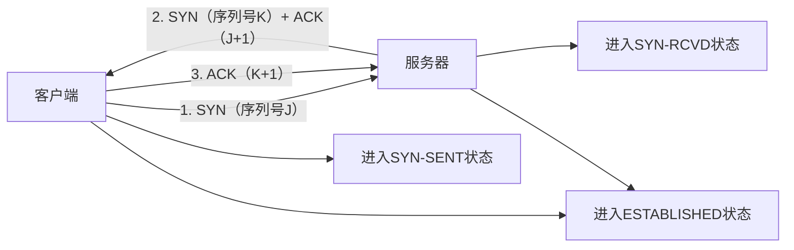

# 网络核心知识：协议与网络模型全解析

## 一、TCP与UDP的核心区别

TCP（传输控制协议）和UDP（用户数据报协议）是传输层两大核心协议，二者在设计理念和特性上差异显著，适用于不同场景。

| 对比维度 | TCP（传输控制协议） | UDP（用户数据报协议） |
|----------|---------------------|-----------------------|
| 连接方式 | 面向连接（需建立连接后传输） | 无连接（直接发送数据） |
| 可靠性 | 高可靠性（确保数据完整、有序到达） | 不可靠（不保证送达、顺序） |
| 顺序保障 | 保证数据包按发送顺序到达 | 不保障顺序，可能乱序 |
| 速度效率 | 较慢（需握手、确认、重传等机制） | 较快（无额外开销，实时性强） |
| 流量控制 | 支持（通过窗口大小调节） | 不支持 |
| 拥塞控制 | 支持（网络拥堵时减少发送量） | 不支持 |
| 适用场景 | 网页浏览、文件传输、邮件发送 | 视频流、在线游戏、实时通讯 |

## 二、TCP如何确保数据正确性？

TCP通过多重机制实现可靠传输，核心逻辑围绕“确认、校验、重传、控速”展开：

1. **数据包确认（ACK）**：接收方收到数据后，会返回确认报文（携带确认号）。发送方未收到确认则触发重传。
2. **序列号与顺序控制**：每个TCP数据包包含序列号，接收方按序列号重组数据，确保顺序正确。
3. **校验和验证**：TCP头部包含校验和字段，接收方通过校验和检测数据是否在传输中损坏。
4. **重传机制**：针对丢失、超时的数据包，发送方会自动重传（分为超时重传、快速重传）。
5. **流量控制（滑动窗口）**：接收方通过“窗口大小”字段告知发送方自己的接收能力，避免接收方被海量数据淹没。
6. **拥塞控制**：通过慢启动、拥塞避免、快速恢复等算法，根据网络状态动态调整发送速率，缓解网络拥堵。

## 三、TCP头部核心字段

TCP头部包含控制传输的关键信息，核心字段如下：

1. **源端口号/目标端口号**：各占16位，用于识别发送方和接收方的应用程序（如HTTP对应80端口）。
2. **序列号**：32位，标识从源端到目标端的字节流顺序，确保数据有序传输。
3. **确认号**：32位，标识发送方期望收到的下一个字节的序列号（仅在ACK标志位有效时生效）。
4. **数据偏移（头部长度）**：4位，指示TCP头部的大小（以32位为单位），用于区分头部和数据部分。
5. **标志位（6个控制位）**：
   - SYN：建立连接时使用（三次握手第一步）。
   - ACK：确认报文标识（大部分TCP报文都携带）。
   - FIN：请求关闭连接（四次挥手第一步）。
   - RST：重置连接（用于处理异常情况）。
   - PSH：推送数据（要求接收方立即交付应用层，不缓存）。
   - URG：紧急数据标识（配合紧急指针使用）。
6. **窗口大小**：16位，用于流量控制，指示接收方当前可接收的最大字节数。
7. **校验和**：16位，用于检测TCP头部和数据部分的传输错误。
8. **紧急指针**：16位，仅在URG标志位有效时使用，指向紧急数据的末尾。

## 四、TCP的层级归属

TCP属于 **TCP/IP模型的传输层（第四层）**，同时也是OSI模型的传输层（第四层）。

传输层的核心职责是：在源主机和目标主机的应用程序之间，提供端到端的可靠或不可靠数据传输服务，屏蔽网络层的细节差异。

## 五、TCP三次握手（建立连接）

TCP是面向连接的协议，通过“三次握手”建立可靠连接，确保双方收发能力正常：

### 握手细节：
1. **第一次握手**：客户端主动发起连接，发送SYN报文（标志位SYN=1），携带初始序列号J，进入SYN-SENT状态。
2. **第二次握手**：服务器接收SYN后，回复SYN+ACK报文（SYN=1、ACK=1），确认号为J+1（回应客户端的SYN），同时携带自己的初始序列号K，进入SYN-RCVD状态。
3. **第三次握手**：客户端接收SYN+ACK后，回复ACK报文（ACK=1），确认号为K+1（回应服务器的SYN），进入ESTABLISHED状态。服务器接收ACK后，也进入ESTABLISHED状态，连接建立完成。

## 六、TCP四次挥手（断开连接）

TCP连接是双向的，断开连接需双方分别关闭各自的发送通道，因此需要“四次挥手”：

### 挥手细节：
1. **第一次挥手**：客户端完成数据发送，发送FIN报文（标志位FIN=1），携带序列号M，进入FIN-WAIT-1状态（不再发送数据，但可接收数据）。
2. **第二次挥手**：服务器接收FIN后，回复ACK报文（确认号M+1），进入CLOSE-WAIT状态（客户端进入FIN-WAIT-2状态）。此时服务器仍可向客户端发送数据。
3. **第三次挥手**：服务器完成数据发送后，发送FIN报文（标志位FIN=1），携带序列号N，进入LAST-ACK状态。
4. **第四次挥手**：客户端接收FIN后，回复ACK报文（确认号N+1），进入TIME-WAIT状态（等待2MSL，确保服务器收到ACK）。服务器接收ACK后，进入CLOSED状态。客户端等待超时后，也进入CLOSED状态，连接彻底断开。

## 七、TCP/IP五层模型（核心网络模型）

TCP/IP五层模型是互联网的核心架构，每层各司其职，通过“封装-传输-解封装”的流程完成数据传输。

### 1. 五层模型分层与职责

| 层级 | 核心职责 | 关键技术/协议 | 数据单位 |
|------|----------|---------------|----------|
| 应用层（第五层） | 提供用户与网络的交互接口，定义应用程序数据格式 | HTTP、HTTPS、FTP、DNS | 数据报文 |
| 传输层（第四层） | 端到端数据传输，提供可靠/不可靠传输服务 | TCP、UDP、端口号 | 报文段（TCP）/数据报（UDP） |
| 网络层（第三层） | 路由选择与寻址，确定数据传输路径 | IP、ICMP、路由器 | IP数据报 |
| 数据链路层（第二层） | 相邻节点间数据传输，差错检测 | MAC地址、以太网帧、交换机 | 数据帧 |
| 物理层（第一层） | 物理介质上传输原始比特流，处理信号编码 | 网线、光纤、无线信号 | 比特流 |

### 2. 数据的逐层封装流程

数据从应用层到物理层传输时，会逐层添加头部信息（解封装时反向移除）：

1. **应用层**：生成原始数据（如HTTP请求报文）。
2. **传输层**：添加TCP/UDP头部（源端口、目标端口、序列号等），形成报文段/数据报。
3. **网络层**：添加IP头部（源IP、目标IP等），形成IP数据报。
4. **数据链路层**：添加帧头部（源MAC、目标MAC）和帧尾部（校验码），形成数据帧。
5. **物理层**：将数据帧转换为比特流（电信号/光信号），通过物理介质传输。

### 3. 五层模型与“浏览器输入地址到建立连接”的关联

以“浏览器输入www.example.com并建立TCP连接”为例，看五层模型的协作流程：

#### （1）应用层：发起请求与协议封装
- 浏览器识别网址，确定使用HTTP/HTTPS协议，生成请求报文（如`GET / HTTP/1.1 Host: www.example.com`）。
- 若为域名，触发DNS解析（应用层协议），获取目标服务器IP地址。

#### （2）传输层：建立TCP连接
- 应用层请求交给传输层，选择TCP协议，发起三次握手建立连接。
- 封装TCP头部（源端口随机，目标端口80/443），将HTTP请求报文作为TCP数据部分。

#### （3）网络层：路由与寻址
- 传输层报文段交给网络层，封装IP头部（源IP为客户端IP，目标IP为DNS解析结果）。
- 网络层通过路由表确定传输路径，将IP数据报转发给下一跳路由器。

#### （4）数据链路层：相邻节点传输
- IP数据报交给数据链路层，封装以太网帧头部（源MAC为客户端网卡MAC，目标MAC为下一跳路由器接口MAC）。
- 通过物理介质（如网线）发送数据帧，相邻节点接收后校验帧的完整性。

#### （5）物理层：比特流传输
- 数据链路层的帧转换为电信号/光信号，通过物理介质（网线、光纤）传输。
- 目标服务器所在网络的物理层接收信号，转换回数据帧，逐层向上解封装，最终应用层接收HTTP请求并处理。
